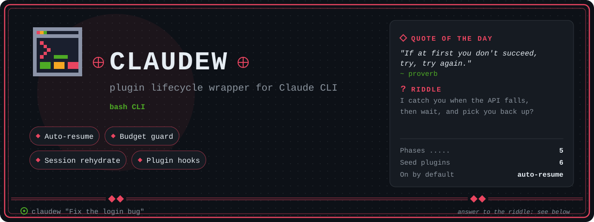

<p align="center">
  
</p>

<h1 align="center"> claudew</h1>

<p align="center">
  Plugin-based lifecycle wrapper for the Claude CLI — auto-resume, session context, budget guard, and more.
</p>

<p align="center">
  
  
  
  
</p>

---

<details>
<summary>Riddle answer</summary>

00-auto-resume: on a rate limit or API error it polls for recovery with exponential backoff and resumes the session.

</details>

## About

**claudew** wraps the `claude` CLI with a plugin-based lifecycle system. Instead of a monolithic script that handles everything, claudew fires hooks at well-defined lifecycle phases — plugins decide what to do at each phase.

The original motivation was auto-resume: when Claude hits a rate limit or API error, claudew detects it, polls for recovery with exponential backoff, and resumes the session automatically. That logic now lives in `00-auto-resume`, the first of 6 seed plugins.

Plugins receive a JSON event blob on stdin and emit `HINT:` lines on stdout that get injected into the next turn's context. The host enforces per-plugin timeouts (bash-native, no GNU coreutils dependency), logs everything, and manages per-plugin state directories.

## Quick Start

```bash
# Clone
git clone https://github.com/alcatraz627/claudew.git ~/.claude/claudew

# Symlink into PATH
ln -s ~/.claude/claudew/claudew.sh ~/.local/bin/claudew

# Use it (drop-in replacement for `claude`)
claudew "Fix the login bug"

# List installed plugins
claudew list

# Enable more plugins
claudew enable 10-session-rehydrate
claudew enable 30-budget-guard
```

## Lifecycle Phases

claudew intercepts 5 lifecycle phases around the `claude` process:

```
pre_spawn ──▶ spawn claude ──▶ post_spawn ──▶ poll (30s) ──▶ on_exit
                                                                 │
                                              on_recover ◀── recovery
                                                   │
                                                   └──▶ loop back
```

| Phase | When | Example Use |
| --- | --- | --- |
| `pre_spawn` | Before `claude` starts | Inject WAL context, check budget |
| `post_spawn` | Right after `claude` starts | Record session start in WAL |
| `poll` | Every 30s while running | Budget threshold warnings |
| `on_exit` | After `claude` exits | Classify exit, log diffs |
| `on_recover` | API health check passes | Emit resume context hints |

## Seed Plugins

| Plugin | Hooks | Default | What It Does |
| --- | --- | --- | --- |
| `00-auto-resume` | on_exit, on_recover | **enabled** | Detect rate limit / API error, poll for recovery, resume session |
| `10-session-rehydrate` | pre_spawn | disabled | Read last WAL checkpoint, inject as context |
| `20-pre-turn-wal` | post_spawn, on_exit | disabled | Write `session_start` and `session_end` WAL entries |
| `30-budget-guard` | pre_spawn, poll | disabled | Warn when 5h rate limit usage exceeds thresholds |
| `40-recent-dir-context` | pre_spawn | disabled | Inject `git log --since=1h` from CWD |
| `50-post-turn-diff` | on_exit | disabled | Run `git diff --stat`, write summary to WAL |

## Writing a Plugin

```bash
# Scaffold a new plugin
claudew new-plugin 60-my-plugin

# This creates:
#   plugins/60-my-plugin/
#   ├── plugin.toml    # metadata + hook declarations
#   └── on_exit.sh     # example hook script
```

Each plugin needs a `plugin.toml`:

```toml
name    = "my-plugin"
hooks   = ["on_exit", "pre_spawn"]
enabled = true
```

Hook scripts receive JSON on stdin and emit `HINT:` lines:

```bash
#!/usr/bin/env bash
EVENT=$(cat)
EXIT_CODE=$(echo "$EVENT" | python3 -c "import sys,json; print(json.load(sys.stdin).get('exit_code',0))")

echo "HINT: My plugin saw exit code $EXIT_CODE"
```

See [PLUGIN-CONTRACT.md](PLUGIN-CONTRACT.md) for the full specification.

## Configuration

Host config lives in `config.toml`:

```toml
[host]
log_dir       = "~/.claude/claudew/logs"
state_dir     = "~/.claude/claudew/state"
max_plugin_ms = 5000    # per-plugin timeout

[plugins]
enabled = ["00-auto-resume"]

[plugin_override."00-auto-resume"]
max_wait_min = 120      # max recovery wait
poll_sec     = 30       # API check interval
```

## CLI Commands

| Command | Description |
| --- | --- |
| `claudew [args...]` | Run claude with plugin lifecycle hooks |
| `claudew list` | Show all plugins with enabled status |
| `claudew enable <name>` | Enable a plugin |
| `claudew disable <name>` | Disable a plugin |
| `claudew new-plugin <name>` | Scaffold a new plugin directory |

## Architecture

```
~/.claude/claudew/
├── claudew.sh              # Host script (entry point)
├── pluginlib.sh            # Plugin runner library
├── config.toml             # Host configuration
├── PLUGIN-CONTRACT.md      # Plugin development guide
├── plugins/
│   ├── 00-auto-resume/     # on_exit.sh, on_recover.sh, plugin.toml
│   ├── 10-session-rehydrate/
│   ├── 20-pre-turn-wal/
│   ├── 30-budget-guard/
│   ├── 40-recent-dir-context/
│   └── 50-post-turn-diff/
├── state/                  # Per-plugin persistent state
└── logs/                   # Daily log files
```

Key components:

- **pluginlib.sh** — TOML parser, plugin discovery (glob + sort by numeric prefix), hook execution with bash-native timeout, JSON event builder, HINT line collection
- **claudew.sh** — Lifecycle orchestrator, exit classification (OK / RATE_LIMIT / API_ERROR / CRASH / USER_QUIT), recovery polling with exponential backoff, session resume via `claude --resume`
- **config.toml** — Host settings, enabled plugin list, per-plugin overrides

## HINT Protocol

Plugins communicate back to the host via stdout. Lines prefixed with `HINT:` are collected and injected into the next turn's `additionalContext`. All other stdout is discarded.

```
stdin:   JSON event {ts, phase, exit_code, stderr_tail, session_id, cwd, pid, retry, class}
stdout:  HINT: lines → additionalContext
exit 0:  continue pipeline
non-0:   logged, does not halt host
timeout: killed after max_plugin_ms (default 5s)
```

## Documentation

| Document | Description |
| --- | --- |
| [PLUGIN-CONTRACT.md](PLUGIN-CONTRACT.md) | Full plugin development contract: directory structure, TOML schema, lifecycle phases, hook I/O, environment variables, timeout behavior, state management |

## Contributing

Contributions are welcome. To add a plugin:

1. Run `claudew new-plugin <NN-name>` to scaffold
2. Edit `plugin.toml` to declare your hooks
3. Write your hook scripts following the contract
4. Test with `claudew enable <name>` and run a session
5. Open a pull request
